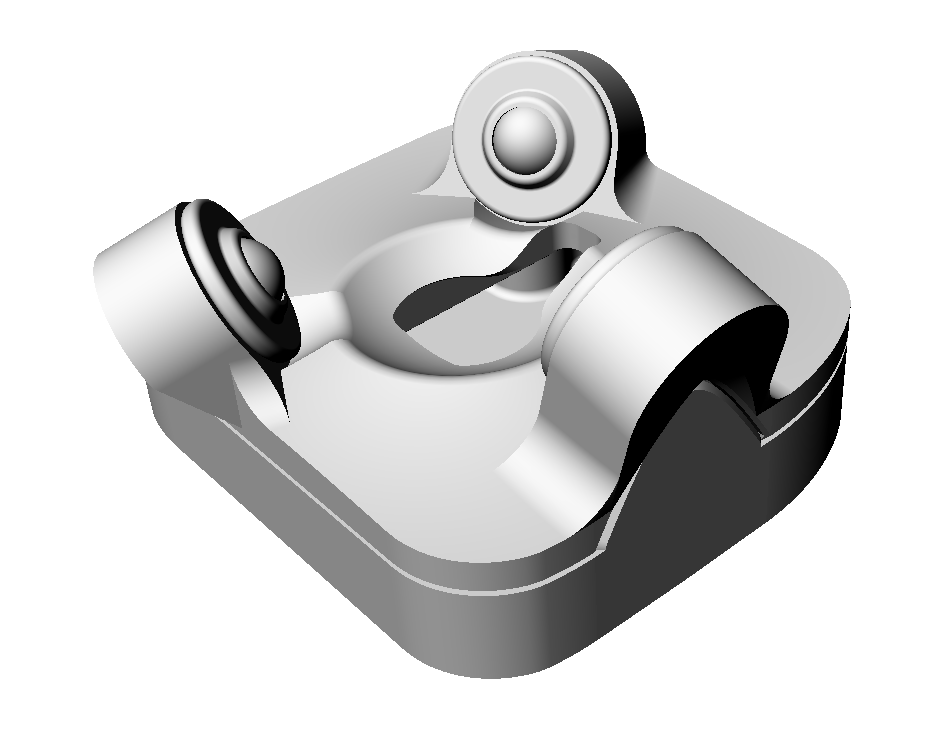
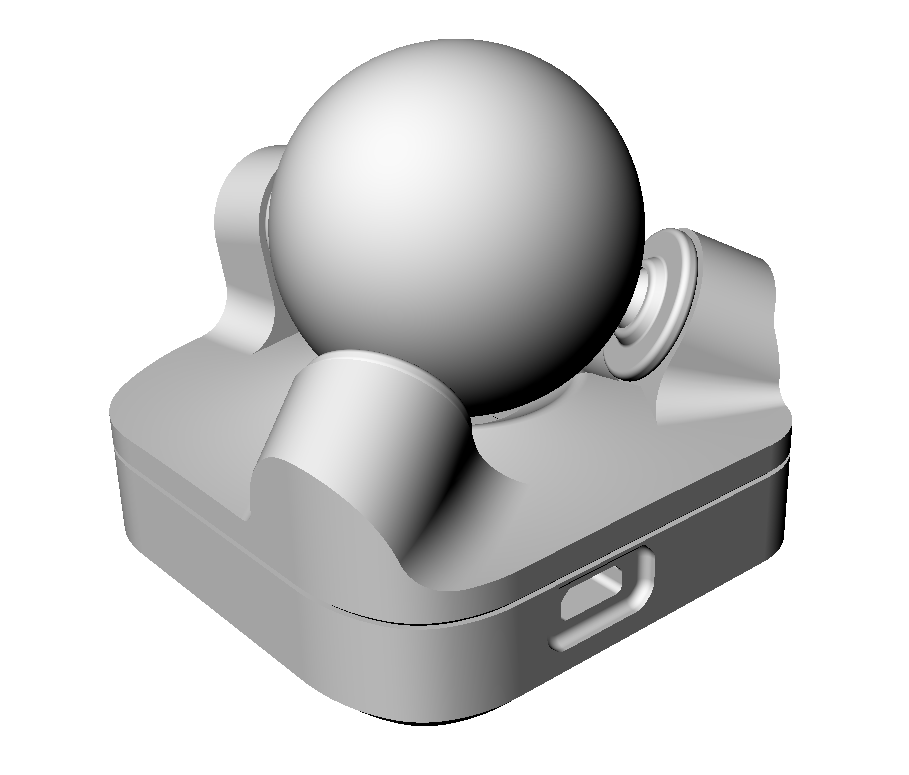

# Ploopy BTU Mod

The roller bearings used in the Ploopy Nano are nice, but with the standard ball they might not feel as smooth or as low-friction as you'd like. The prompt for this mod was "what if we replaced them with ball transfer units?"

It turns out - good things happen!

Ball transfer units (or BTUs) are omnidirectional bearings, as opposed to the single-direction roller bearings the Ploopy Trackball uses by default. This means you're never rolling the ball in the "wrong direction" for one of them.

This mod is a new 3D-printable top and bottom piece for the Ploopy which contains holes for ball transfer units instead of roller bearings. The new bottom piece is only required for a little clearance for the highest bearing - you may be able to get away without the modified base, or with just some sanding of the original base.

Designer: [George Bryant](https://github.com/gbrnt)

## Versions
### v1
This was designed in Rhino and so isn't really editable for most people.
The STEP files are provided in case you'd like to try it!

## Buying the BTUs
The particular BTU this mod is designed for is the Bosch-Rexroth R053010810, or KU-B8-OFK. A set of three is about 20-30 USD, depending on where in the world you are and where you buy them from. Here are some sources we've found so far:

* [Bosch-Rexroth](https://www.boschrexroth.com/en/xc/products/product-groups/linear-motion-technology/ball-transfer-units-and-tolerance-rings/ball-transfer-units/r0530-with-sheet-steel-housing/r0530-1-with-sheet-steel-housing) - UK and worldwide, but requires you to be a company (e.g. have a VAT number)
* [Livhaven](https://store.livhaven.com/r053010810-bosch-rexroth-ball-transfer-unit) - US-based. Doesn't require company information, but overseas shipping is expensive.
* [L-System](https://l-system.nu/webshop/linear-technology/ball-transfer-units-and-tolerance-rings/ball-transfer-units/type-r0530/ball-transfer-unit-ku-b8-ofk/) - Sweden-based. Might allow private customers to buy.
* [Spareparts](https://www.sp-spareparts.com/en/p/r053010810-bosch-rexroth) - Ireland-based. Ships to UK and maybe elsewhere. Does sell to private customers.
* [Rodivago](https://rodavigo.net/es/p/bola-transportadora-con-carter-de-metal-laminado-ref-053010810/557053010810) - Spain-based. May require being a company.
* For other sources, try Bosch-Rexroth's [contact locator tool](https://addresses.boschrexroth.com/) - find a distributor near you, and search for the bearing part number on their website.

## Printing
Follow [Ploopyco's recommendations for print settings](https://github.com/ploopyco/nano-trackball/wiki/Appendix-B%3A-3D-printed-parts), unless you know better!

## Assembly
* Remove all support material from the print.
* Inspect the holes the BTUs will sit in to make sure there are no lumps inside the hole. File/sand/cut them off if needed.
* Install the BTUs by pushing them into the holes. If they're a bit loose and can fall out, stick a bit of tape to the edge of the BTU before installing it.
* Check the BTUs are fully installed by putting the ball on top and pressing it down gently but firmly.
* Remove the original top piece from your Ploopy Nano.
* Install the new top piece on the trackball.
* Give it a try!
